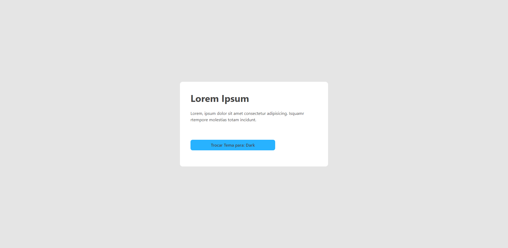
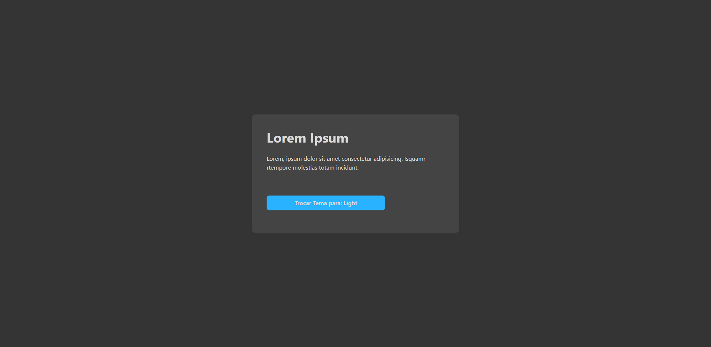

<h1 align="center">
    
</h1>

## **💻Sobre o projeto**

Projeto criado para utilizar a funcionalidade de **Light e Dark** do **Chakra UI** com **React**. Onde o estado do tema (light ou dark) fica salvo dentro do localStorage, e com isso, fica fácil o acesso a essa informação, alterando as cores de maneira simples com apenas um click no botão.

## **🛠 Tecnologias**

As seguintes ferramentas foram usadas na construção do projeto:

- **[React](https://github.com/facebook/react)**
- **[Chakra UI](https://chakra-ui.com/)**
    

## ☀️ Light Card

  

## 🌙 Dark Card

  
